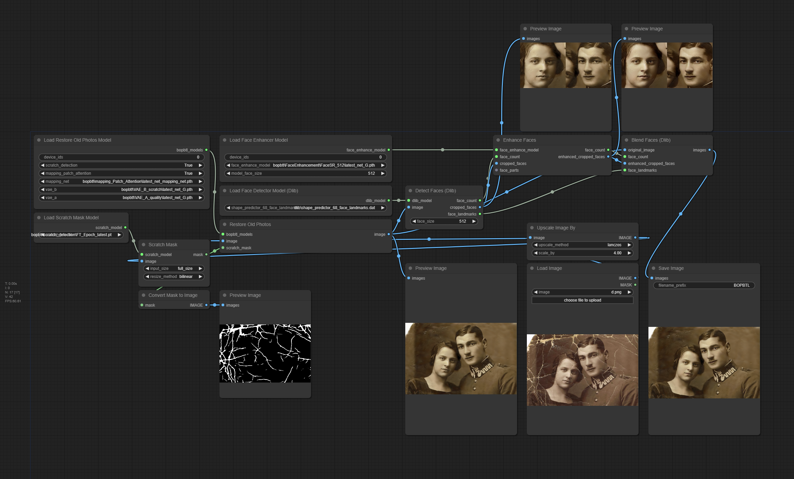
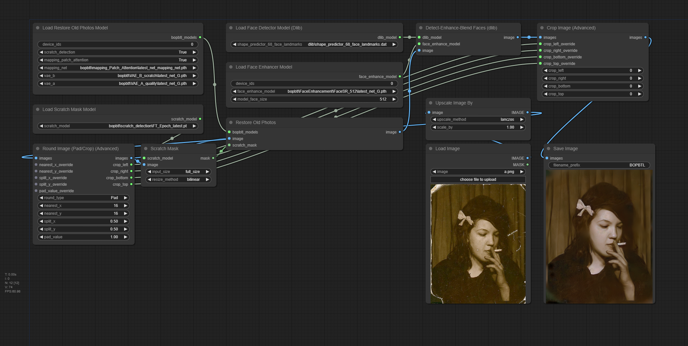
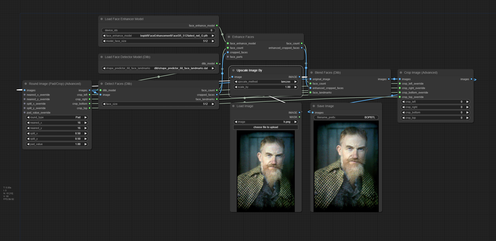
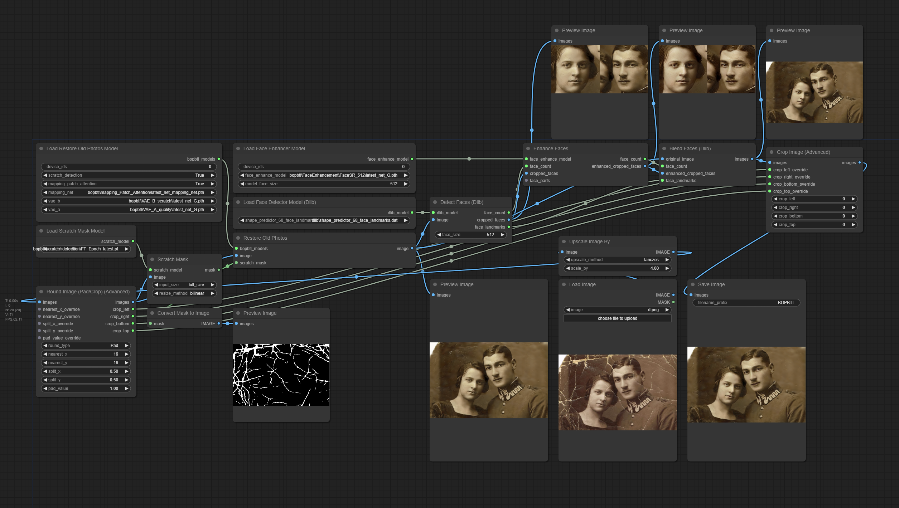

# ComfyUI-Bringing-Old-Photos-Back-to-Life

Enhance old or low-quality images in [ComfyUI](https://github.com/comfyanonymous/ComfyUI). Optional features include automatic scratch removal and face enhancement. Requires installing a number of small checkpoints and VAEs.

Based on [microsoft/Bringing-Old-Photos-Back-to-Life](https://github.com/microsoft/Bringing-Old-Photos-Back-to-Life).


## 1. Requirements

Before installing, make sure that any virtual environment is activated and if needed, prepend the target python executable before the pip command.

```shell
cd ./ComfyUI-Bringing-Old-Photos-Back-to-Life/
path\to\python.exe pip install -r requirements.txt --upgrade
```

PyTorch and TorchVision are also required, but should already be installed. (See the main ComfyUI repo for [installation details](https://github.com/comfyanonymous/ComfyUI?tab=readme-ov-file#installing).)

### Installation Troubleshooting

You may encounter issues while trying to install dlib on Windows. Here are some possible solutions:

1. Manually install requirements.

You may need to have [CMake](https://cmake.org/download/) already installed on your system and `CMake\bin` added to your PATH to build Dlib.

```shell
path\to\python.exe -m pip install easydict matplotlib opencv-python scikit-image scipy

path\to\python.exe -m pip install cmake
path\to\python.exe -m pip install dlib==19.24.1
```

2. Find pre-built wheels online.

Alternatively, some people have pre-built wheels for Dlib, however, there may not be any built with your version of python.

```
path\to\python.exe -m pip install path\to\dlib.whl
```

## 2. Models

### BOPBTL Models (Stage 1)

[Download - BOPBTL Models](https://github.com/microsoft/Bringing-Old-Photos-Back-to-Life/releases/download/v1.0/global_checkpoints.zip)

#### Load Restore Old Photos Model

Set `device_ids` as a comma separated list of device ids (i.e. `0` or `1,2`). Use `-1` for cpu.

##### vae_a

Place in `models/vae/`.

- restoration/VAE_A_quality/latest_net_G.pth

##### vae_b

Extract the following models and place them inside `models/vae/`.

- restoration/VAE_B_quality/latest_net_G.pth
- restoration/VAE_B_scratch/latest_net_G.pth (scratch_detection)

##### mapping_net

Extract the following models and place them inside `models/checkpoints/`.

- restoration/mapping_quality/latest_net_mapping_net.pth
- restoration/mapping_scratch/latest_net_mapping_net.pth (scratch_detection)
- restoration/mapping_Patch_Attention/latest_net_mapping_net.pth (mapping_patch_attention)

#### Load Scratch Mask Model

##### scratch_model

Extract the following models and place them inside `models/checkpoints/`.

- detection/FT_Epoch_latest.pt

### Face Detection Models (Stages 2-4)

#### Load Face Detector Model (Dlib)

[Download - shape_predictor_68_face_landmarks.dat](http://dlib.net/files/shape_predictor_68_face_landmarks.dat.bz2)

Extract the following models and place them inside `models/facedetection/` (custom directory).

##### shape_predictor_68_face_landmarks

- shape_predictor_68_face_landmarks.dat

#### Load Face Enhancer Model

[Download - Face Enhancement Models](https://github.com/microsoft/Bringing-Old-Photos-Back-to-Life/releases/download/v1.0/face_checkpoints.zip)

Extract the following models and place them inside `models/checkpoints/`.

Set `device_ids` as a comma separated list of device ids (i.e. `0` or `1,2`). Use `-1` for cpu.

##### face_enhance_model

- Setting_9_epoch_100/latest_net_G.pth (256x256)
- FaceSR_512/latest_net_G.pth (512x512)

## 3. Workflows

### BOPBTL + Scratch Detection and Face Enhancement (Stages 1-4)


### Face Enhancement (Advanced) (Stages 2-4)


### x4 BOPBTL + Scratch Detection and Face Enhancement (Advanced) (Stages 1-4)



### Using [ComfyUI-Image-Round](https://github.com/cdb-boop/comfyui-image-round) Nodes

Running the models may fail if image dimensions are not multiples of 8 or 16 pixels (depends on the model used).







## 4. Hints

- Images may need to be scaled/cropped/padded to the nearest 8 or 16 pixels to avoid a crash. (Use something like my other [ComfyUI-Image-Round](https://github.com/cdb-boop/comfyui-image-round) nodes.)
- "Detect Faces (Dlib)" and "Enhance Faces" nodes will currently return the original image if no faces were found.

## Citation

```bibtex
@inproceedings{wan2020bringing,
  title={Bringing Old Photos Back to Life},
  author={Wan, Ziyu and Zhang, Bo and Chen, Dongdong and Zhang, Pan and Chen, Dong and Liao, Jing and Wen, Fang},
  booktitle={Proceedings of the IEEE/CVF Conference on Computer Vision and Pattern Recognition},
  pages={2747--2757},
  year={2020}
}
```

```bibtex
@article{wan2020old,
  title={Old Photo Restoration via Deep Latent Space Translation},
  author={Wan, Ziyu and Zhang, Bo and Chen, Dongdong and Zhang, Pan and Chen, Dong and Liao, Jing and Wen, Fang},
  journal={arXiv preprint arXiv:2009.07047},
  year={2020}
}
```

## License

The codes and the pretrained model in this repository are under the MIT license as specified by the LICENSE file. We use our labeled dataset to train the scratch detection model.

This project has adopted the [Microsoft Open Source Code of Conduct](https://opensource.microsoft.com/codeofconduct/). For more information see the [Code of Conduct FAQ](https://opensource.microsoft.com/codeofconduct/faq/) or contact [opencode@microsoft.com](mailto:opencode@microsoft.com) with any additional questions or comments.
